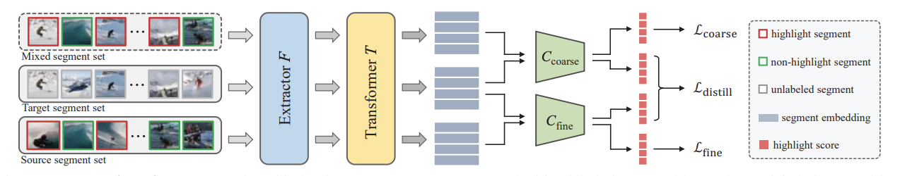

# Highlight Detection Survey.

## Problems
+ Find relevant moments in existing videos for producing new content or just getting creation hints from such references
+ Scan highlights and extract it for sharing to social media. 

## Recent solutions
+ [Cross-category Video Highlight Detection via Set-based Learning](https://openaccess.thecvf.com/content/ICCV2021/papers/Xu_Cross-Category_Video_Highlight_Detection_via_Set-Based_Learning_ICCV_2021_paper.pdf): 
  + **Aprroach**: Divide videos into many segment set and use classify model to determine where the segment set is. 
  + **Highlight**: 
    + Propose a *learning/inference scheme* for learning and inference of the task. 
    + Prove transformer based architecture can be used for the tasks. 
    + Prove knowledge distillation have a good effect for the task. 
  + **Architecture**: 

> This task aim to transfer the knowledge about highlight moments on source video to targer one. However, the task's approaching also can inherit for our task. This may discuss later on purpose session. 

+ [Less is More: Learning Highlight Detection from Video Duration](https://openaccess.thecvf.com/content_CVPR_2019/papers/Xiong_Less_Is_More_Learning_Highlight_Detection_From_Video_Duration_CVPR_2019_paper.pdf):
  + **Purpose**: 
  + **Approach**: 
  + **HighLight**:
  + **Architecture**:
  + 
+ [UMT: Unified Multi-modal Transformers for Joint Video Moment Retrieval and Highlight Detection](https://arxiv.org/pdf/2203.12745.pdf)

 
 ## Problems:
+ Models for highlight extracting is really large $\to$ Can't use on edge devices $\to$ Videos have to push on server $\to$ heavy depend on internet and very slow processs. 
+ The hardw

# References
+ [Paper](https://arxiv.org/pdf/2203.12745.pdf)
+ [Dataset](https://paperswithcode.com/paper/qvhighlights-detecting-moments-and-highlights)