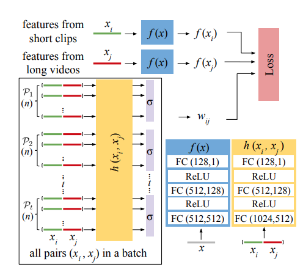
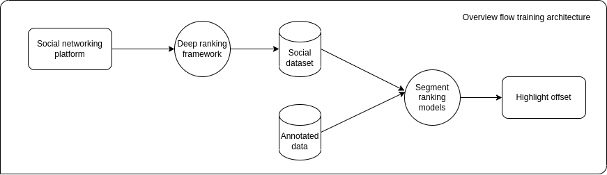
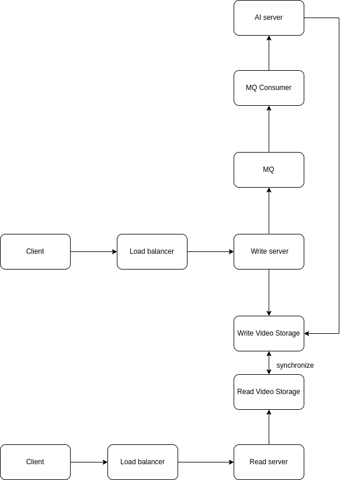

# Highlight Detection Survey.

## Problems and Popular Strategy
+ **Problems**:
  + Find relevant moments in existing videos for producing new content or just getting creation hints from such references
  + Scan highlights and extract it for sharing to social media. 
+ **Popular Strategy**:
  + The first strategy poses highligh detection as a supervised learning task. Given unedited videos together with manual annotations for their highlights $\to$ train a ranker for scoring highlight segment.  
  + Second strategy consider highlight learning as a weakly supervised recognition task. Given a domain-specific videos, the system discovers what appears commonly among the training samples and learns to detect such segments as highlights in novel videos for the same domain. 

## Recent solutions
+ [Cross-category Video Highlight Detection via Set-based Learning](https://openaccess.thecvf.com/content/ICCV2021/papers/Xu_Cross-Category_Video_Highlight_Detection_via_Set-Based_Learning_ICCV_2021_paper.pdf): 
  + **Aprroach**: Divide videos into many segment set and use classify model to determine where the segment set is. 
  + **Highlight**: 
    + Propose a *learning/inference scheme* for learning and inference of the task. 
    + Prove transformer based architecture can be used for the tasks. 
    + Prove knowledge distillation have a good effect for the task. 
  + **Architecture**: 

> This task aim to transfer the knowledge about highlight moments on source video to targer one. However, the task's approaching also can inherit for our task. This may discuss later on purpose session. 

+ [Less is More: Learning Highlight Detection from Video Duration](https://openaccess.thecvf.com/content_CVPR_2019/papers/Xiong_Less_Is_More_Learning_Highlight_Detection_From_Video_Duration_CVPR_2019_paper.pdf):
  + **Purpose**: 
    + Propose a method for training with lack of labeled dataset.
  + **Approach**: 
    + Dataset: crawl Instagram videos with hashtags $\to$ using a novel ranking model to remove some noisies. 
  + **HighLight**:
    + Created a method for collecting dataset $\to$ prove by improving state of the art by 22%
  + **Architecture**: 
  

  
  

+ [UMT: Unified Multi-modal Transformers for Joint Video Moment Retrieval and Highlight Detection](https://arxiv.org/pdf/2203.12745.pdf)
  + **Purpose**:
    + Use multi-model for the task moment retrieval
  + **Hightlight**:
    + Prove collaborate image and audio can significant improve the task
> This method can use for our task. It proved that using collaborate audio and image can significant improve results.
 

## My Propose
+ Approach the task as supervised learning but using data argument method of [Less is More: Learning Highlight Detection from Video Duration](https://openaccess.thecvf.com/content_CVPR_2019/papers/Xiong_Less_Is_More_Learning_Highlight_Detection_From_Video_Duration_CVPR_2019_paper.pdf).
+ **Training flow architecture**.

+ **Model architecture**

+ **System Architecture**:

  + `AI server`: can be used [Triton](https://github.com/triton-inference-server/server).
 ## Future Problems:
+ Models for highlight extracting is really large $\to$ Can't use on edge devices $\to$ Videos have to push on server $\to$ heavy depend on internet and very slow processs. 
+ Storage for video and audio are large $\to$ hard for scaling and duplicate database. 

# References
+ [Paper](https://arxiv.org/pdf/2203.12745.pdf)
+ [Dataset](https://paperswithcode.com/paper/qvhighlights-detecting-moments-and-highlights)