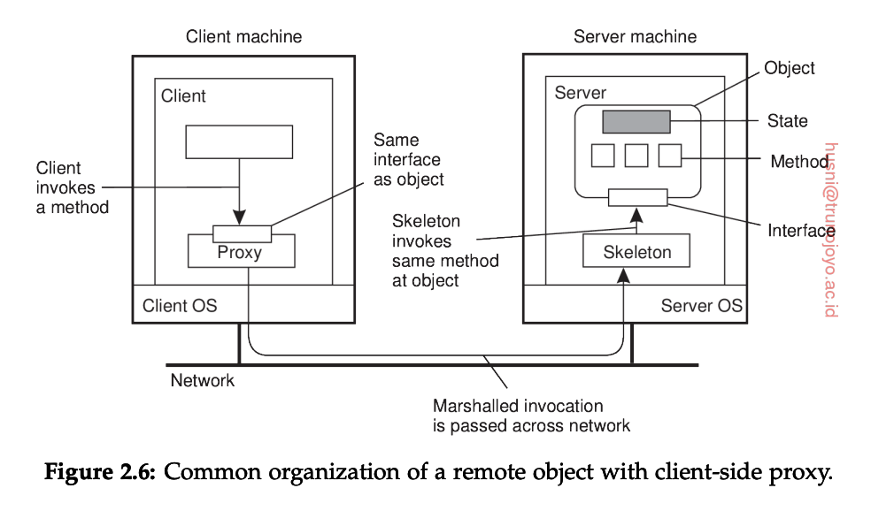

# Architectural styles

+ Layered architetures.
+ Object-based architetures.
+ Resource-centered architectures.
+ Event-based architetures.

1. Layered architetures. 
+ Break down the system into distinct layers, each of which responsible for specific aspect of the design
$\to$ need communication-protocol for interacting betwwen another layers. It called **Communication services** $\to$ communication protocol

2. Object-based and service-oriented architectures.

3. Resource-based architectures.
4. Event-based architetures.