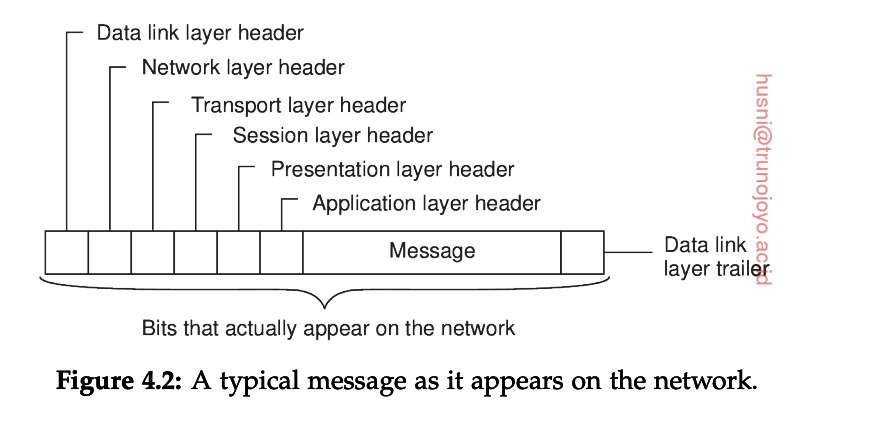
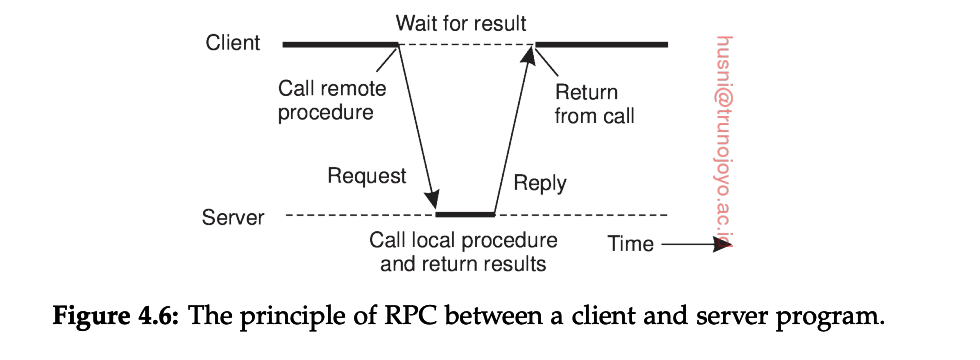
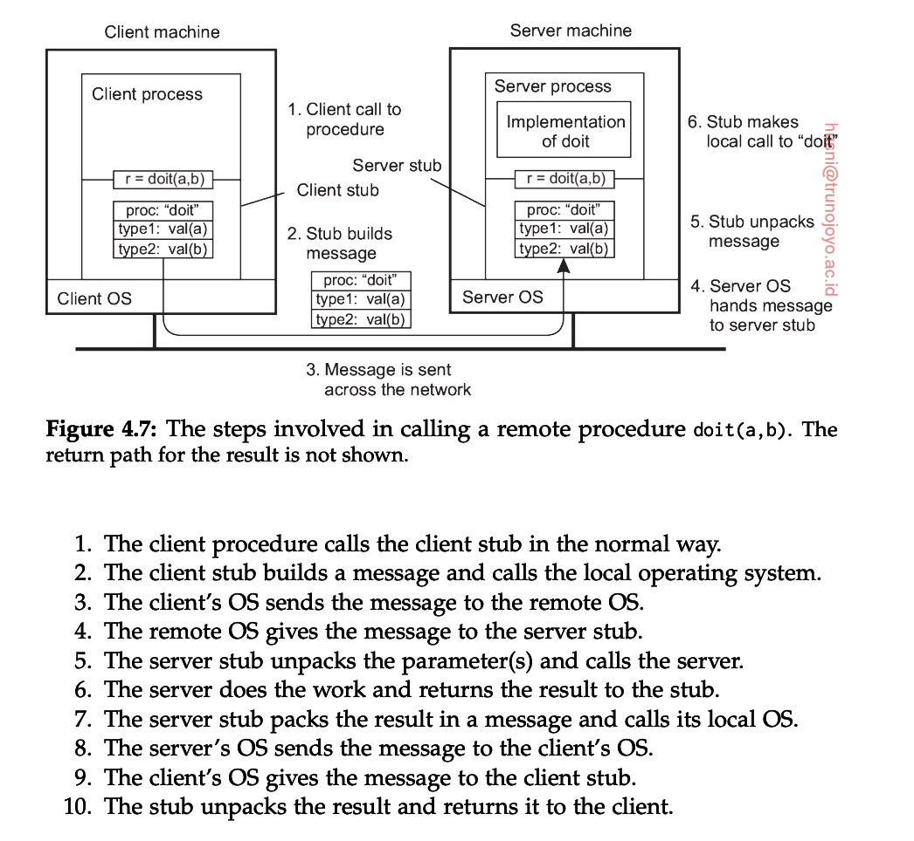
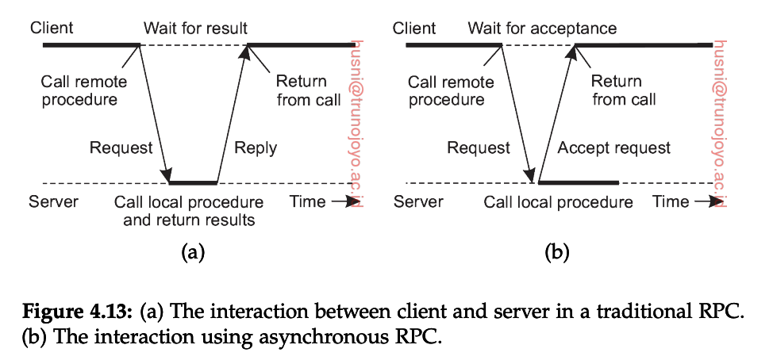
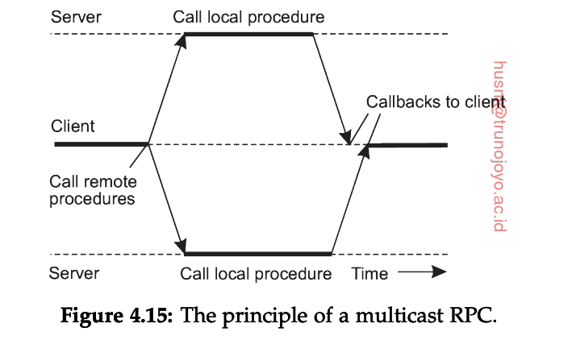
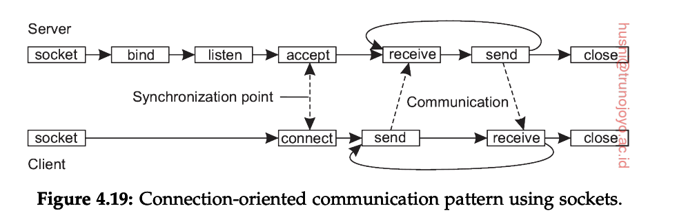
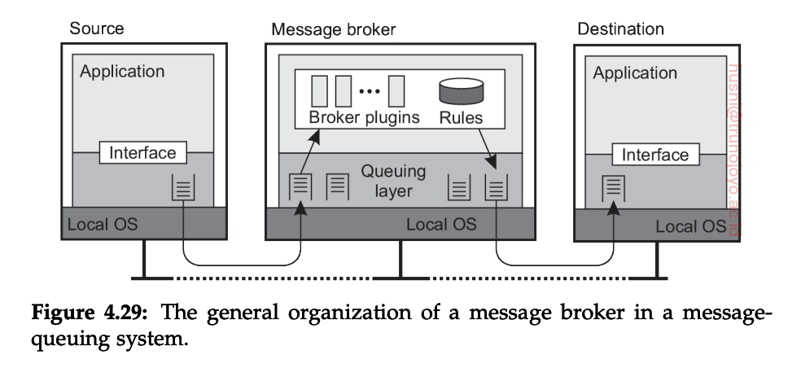
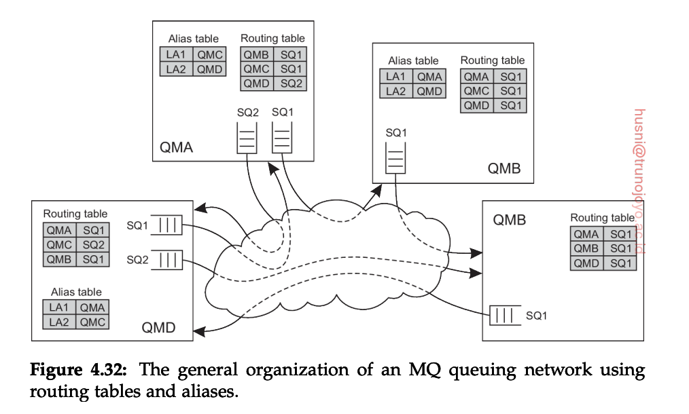
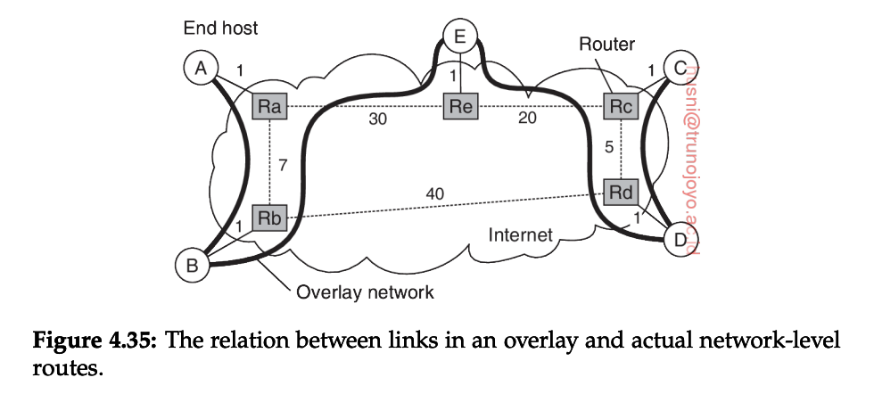

# Communication 
+ All communication in distributed systems in based on sending and receiving(low level messages).
+ Ex: Process P wants to communicate with process Q. 
    1. P builds a message in its own address space
    2. P executes a system call that causes the operating system to send the message over the network to Q.
    $\to$ Problem: when it come to large. It can cause of chaos $\to$ P should define the meaning of the bits being sent.
## THE OSI reference model
+ The OSI model is designed to allow open systems to communicate. 

<src img="Media/distributed_systems/OSI_model.png"  >

+ A message from A to B can be divided into manageable pieces, each of which can be solved independently of the others. Each layer have its own interface and operations that together define the service. It containts:
    + *Physical layer*: Deals with standardizing how to computers are connected and how 0s and 1s are presented.
    + *Data link layer*: Provides the means to detect and possibly correct transmission errors, as well as protocols to keep a sender and receiver in the same pace. 
    + *Network layer*: Contains the protocols for routing a message through a computer network, as well as protocols for handling congestion. 
    + *Transport layer*: Mainly contains protocols for directly supporting applications, such as those that establish reliable communication, or support real-time streaming of data (TCP/UDP)
    + *Session layer*: Provides support for sessions between applications.
    + *Presentation layer*: Prescribes how data is presented in a way that is independent of hosts on which communicating applications are running. 
    + *Application layer*: Essentially, everything else: e-mail protocols, web access protocols, file-transfer protocols, and so on. 

+ **Flow of messages** : process P wants to communicate with some remote process Q.
    1. It build a message and passes that message to the application layer. 
    2. Application layer adds a header to the front of the message and passes it to presentation layer.
    3. The presentation layer adds own header then passes to session layer. and so on ... 
    4. In the end, Physical layer transmits the message by putting it onto the physical transmission medium. 
    5. Q received message and passes it upward, wich each layer stripping off the examining its own header. 

## Types of Communication
1. **Remote Procedure Call**
+ Idea behind: make a remote procedure call look as much as possible like a local one. 

**Parameter passing**
+ Following the above diagram, the packing and unpacking parameter are not easy:
    + How should the meta-information be recognized by the server?
    + the placement of bytes in memory may differ between machine architectures.
$\to$ make sure both communucating parties have the same *message data type* to be transmitted. 

**Variations on RPC**

+ **Asynchronous RPC**

+ To support situation in which there is simply no result to return to the client. 
+ The server immediately sends a reply back to the client the moment the RPC request is received, after which it locally calls the requested procedure. 
+ The reply acts as an acknowledgement to the client that the server is going to process the RPC $\to$ the client will continue without futher blocking as soon as it has received the server's acknowledgement. 

+ **Multicast RPC**
+ sending a request to a group of servers. 

2. **Message-oriented communication**

**Transient message**

+ *Simple transient messaging with sockets*
+ Set up a connection (TCP/UDP), then tranfer message  between sender and receiver via connection.

+ *Using messaging patterns: ZeroMQ*

**Message-oriented persistent communication**
1. **Message-queuing model**: Instead of sending message direct from client to server, client sent the messages to the private queue of server. 
    + sender just make sure the message will inserted to receiver queue but do not know when it was processed.
    + The sender and receiver can execute completely independently. 
+ **Message brokers**:
    + Message broker main purpose is to convert incoming messages to that they can be understood by the destination application. 
    + A message broker can be as simple as a reformatter for messages.
    + A message broker may act as an application-level gateway, in which information on the messaging protocol of several applications has been encoded. 
    $\to$ the heart of message broker lies a respository of rules for transforming a message of one type to another. 

    
+ **Message Channels**
    + Each message channel has exactly one associated send queue from with it fetches the messages it should transfer to the other end. 
    + Transfer along the channel can take place only if both its sending and receiving MCA(Message Channel Agent) are up and running.

+ **Message transfer**
    + To transfer a message from one queue manager to another $\to$ it is necessary that each message carries its destination address, for which a transmission header is used. 
    + An address in MQ consists of 2 parts:
        + Name queue manager to which that a message is to be delivered.
        + Name of destination queue resorting under that manager to which the message is to be appended. 
    $\to$ the routing parts will extract and re-direct the messages when it read message header.

+ **Recent most popular used Message queue**
    + [Apache Kafka](../../notes/Tools/Kafka.md)
    + [RabbitMQ](https://viblo.asia/p/tim-hieu-ve-rabbitmq-OeVKB8bMlkW)

## Mutlicast Communication.

### Application-level tree-based multicasting.

+ Nodes orgaize into an overlay network, which is then used to disseminate information to its memebers.
+ **Performance issues in overlays**

+ The quality of an application-level multicast tree is generally measured by 3 metrics: *link stress* , *stretch*, *tree cost*.
    + **Link stress**: is defined per link and counts how often a packate crosses the same link. 
    + **Stretch** or **Relative Delay Penalty**: measures the ratio in the delay between two nodes in the overlay, and the the delay that those two nodes would experience in the underlying network. 
    + **Tree cost**: is a global metric, generally related to minimizing the aggregated link costs. 