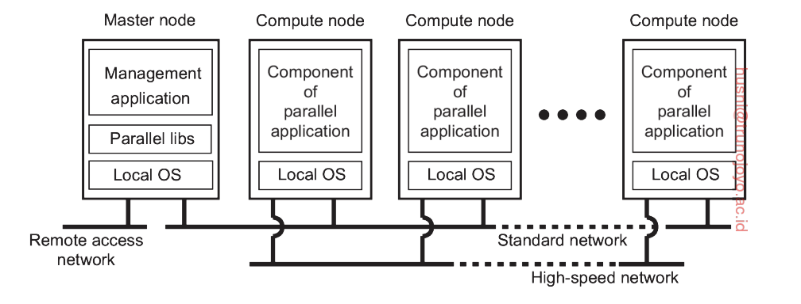

# Introduction

## What is a distributed system?

*A distributed system is a collection of autonomous computing elements that appears to its users as a single coherent system*
$\to$ Its divided into 2 parts
    1. Collection of autonomous computing elements
    2. Single conherent system

## 1. Types of distributed systems

### 1.1 Cluster computing.
+ Cluster computing is used for *parallel programming* in which a single (computer intensive) *programe is run in parallel on multiple machines*. $\to$ Depend on network between computers.  

<figcaption> 1.1 Example of a custer computer system </figcaption>

### 1.2 Grid computing.
+ Gather many computer to a shared pool that can be accessed on-demaind by users.
$\to$ can run large tasks that single computer can't compute.

### 1.3 Cloud computing.
+ Resources on internet that users can used without any local hardware or infrastructure.