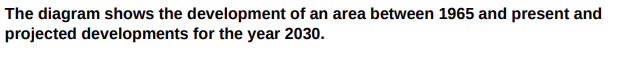

# **Map**

**I. Introduction**: 
  + use present simple
  + Describe what the map is about, the location, time
  + Do not copy the question $\to$ paraphrase it
  
Ex: 

$\to$ The two maps illustrate the changes which have taken place in a specific area since 1965 and proposed developments for 2030.

+ The diagrams $\to$ the two maps 
               $\to$ the two given maps

+ The development(s) $\to$ the changes (modernization, urbanization, industrialization)
+ The changes that/which take place/ occur in
+ **Place**
 projected $\to$ proposed/planned
## Viết overview và topic sentence cho các đoạn trong body. 
> 1. S + experienced/saw/witnessed/underwent + adj + Noun

Ex: The are experienced dramatic urbanization
> 2. + S + to be + V-ed + adv
>  + S + to be + adv + V-ed
  
Ex: The area was urbanization dramatically
> 3. There was/were + (a/an) adj + noun

Ex: there were a dramatic urbanization in the area.

**II. Kéo dài overview**
> + Biến đổi từ cai gì $\dots$ thành $\dots$ (from $\dots$ to)
> + Khu vực đã biến đổi hoàn toàn.
> + Với việc xây dựng $\dots$ sự biến mất của 

With the construction of $\dots$ at the expense of $\dots$

Ex: Overall, the area has been dramatically urbanized with the construction of transport infrastructure and residential areas at the expense of a large area of woodland.

+ **Thường dùng bị động khi viết Map**
>  1. Cây bị chăt

The trees has been chopped down/ cut down
>  2. Nhà cũ/ Công trình cũ bị dở bỏ.

to be knocked down/ to be demolished

>  3. Những cái mới được xây dựng. 

to be built = to be constructed
>  4. To be replaced by (passive) = make way for (active) = give way to (active)

The forest has been replaced by a large car park

The forest has made way for a large car park. 

>   5. to be converted into something (passive) = to be turned into something (passive) $\to$ thường dùng khi chuyển đổi mục dích sử dụng. 

Ex: The old factory has been converted into a museum. 

>   6. Cái gì giữ nguyên: 

>  + S + (has/have) remained (active)
   The shops in the south of the town have remained.
>  7. Sự thay đổi/ phát triển/ đô thị hóa được diễn ra. 

Take place / occur in.

>    8. S + V, with N + V-ing: vế 2 bổ nghĩa cho vế thứ nhất. 

>    9. Mô tả vị trị đúng trong bản đồ 

+ In the north/south/west/east of the area: Nằm bên trong

+ (to the) north/south/west/east ò something: nằm về phía bắc/nam/dông/tây so với cái gì đó. 

   Eg: there was a car park to the east side of the Hospital road.  

>    10. Với các con đường 
+ Along the north side of the street.

+ On the north side of the road.

> **TIPS**:  
> + Cái cũ thì dùng  "the" cái mới thì dùng "a/an".
> + Thêm cụm từ chỉ vị trí vào câu. 

   

