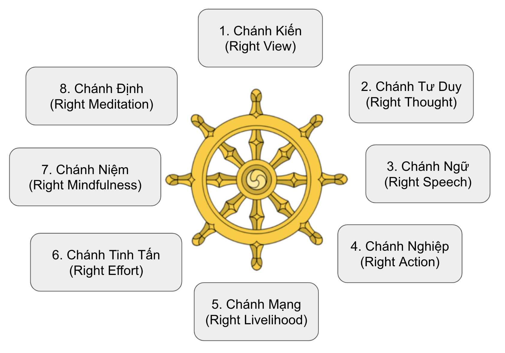

# Bát Chánh Đạo
> Bát Chánh đạo hay con gọi là bát chánh đạo phần.

+ Muốn tìm con đường chuyển hoá thì tìm ở đâu? 
  + Tìm không sinh tử ở trong sinh tử. 
  + Tìm không khổ ở trong khổ. 
+ Đạo là con đường tìm ra trong hoàn cảnh đau khổ của chúng ta $\to$ Không có khổ thì không có đạo
$\to$ Đạo đế được tạo ra bởi khổ đế. $\to$ Tìm đạo ở trong *khổ* và trong *tập*.
$\to$ đối mắt với đau khổ, tìm cách tiếp xúc, đối diện của đau khổ để tìm *đạo*. 

