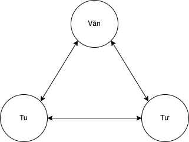

# Chánh Kiến - Right View
> **Chánh kiến** là kháng thể của "tâm hồn"

> Quá trình của sự phát triển tuệ giác: Niệm $\to$ Định $\to$ Tuệ.
> Sao lại k dùng *Chánh Tuệ* mà lại dùng *Chánh kiến*: 
>   + Đứng về phần thân: Chánh kiến là 1 mớ giáo lý(có tính cách ký thuyết hơn thực hành) nhưng nó chứa hạt giống của tuệ giác $\to$ nhờ quá trình văn-tư-tu thì nó trở thành tuệ giác chân thực $\to$ mới thành Tuệ
>   +  Chánh kiến là những kiến thức ban đầu $\to$ người học không hài lòng $\to$ thực tập để sinh ra Tuệ.
> 
  

+ **Chánh Kiến**: tức là thấy được tam bảo, thấy được thiện ác, thấy được con đường hướng thượng. Nhưng trước hết ta phải nói, **Chánh kiến** là thấy được 4 sự thật, thấy được bản chất của 4 sự thật.

+ Trước hết phải có cách nhìn chính xác về 4 sự thật (4 diệu đế) $\to$  để nhìn nhận đúng 4 diệu đế cần có công phu rất sâu về tu tập, cần nhiều thời gian để thực tập.

+ Có 2 mặt, 2 gia đoạn:
  + Hữu lậu: Tương đối $\to$ tục đế 
  + Vô lậu : Tuyệt đối $\to$ Chân đế.

> Nhị đế tương thông: Tục đế không trái chống với chân đế, và chân đế chứ tục đế.
> Trong chân đế chứa tục đế, trong tục đế chứa chân đế. 
+ Tu tập, học hỏi đi qua quá trình **Văn - Tư - Tu**
  + **Văn**: Học hỏi, nghe giảng, đọc sách. $\to$ tiếp nhận kiến thức lý thuyết. 
  + **Tư**: dùng trí thông mình, kinh nghiệm của mình mà chiêm nghiệm, quán chiếu. 
  + **Tu**: Đem những cái mình học và hiểu để ra thực tập. 

<figcaption> Quá trình học hỏi </figcaption>

> Qúa trình *Văn-Tư-Tu* luôn xuất phát từ *Tục Đế*(dùng ngôn ngữ, khái niệm để tu tập) $\to$ có kinh nghiệm $\to$ không bị bó buộc bởi khái niệm ngôn ngữ $\to$ sinh ra *chân đế*. 

> Nguyên tắc để thoát khổ là đi sâu vào cái khổ của chúng ta, đối mắt với sự đau khổ $\to$ tìm lạc trong khổ. 

+ Khổ và Các giai đoạn thoát khổ:
  + Khổ nhưng không biết mình khổ.
    + Ví dụ: Con lạc đà chở hàng rất nặng $\to$ Ngu si không biết mình là khổ, không biết thoát khổ đó mới là khổ chân thật.
  + Văn - Tư -Tu: Nhận biết cái khổ, quán chiếu, gọi tên, nhìn vào cái khổ
    + Vận dụng văn-tu-tư thì thấy được bản chất của khổ.
      + 1. Nhìn vào khổ: bệnh ho để thấy triệu chứng (hình tướng) $\to$ để đoán đúng bệnh, ví dụ ho gà, ho lao
      + 2. Tìm nguyên do(tập): Thấy được gốc rễ gần xa, nguyên do của bệnh ho  (ăn uống, sinh hoạt ...) $\to$ cần thời gian, trí tuệ và thực tập.
      + 3. Khổ Diệt: Ngày xưa mình có hạnh phúc, vô sự $\to$ biến mất $\to$ sinh ra khổ $\to$ tìm cách(đạo) trở về cái không khổ. 
+ Tập: Nguyên nhân của khổ. 
  + Hàng ngày gây ra khổ mà không biết.
    + Suy nghĩ hằng ngày
    + Mong muốn hằng ngày
    + Lời nói hằng ngày 
  + Nhận diện, quán chiều để thấy được nguyên nhân của khổ. 
    + Nhận diện được những cái mình đã nói, đã làm hằng ngày 
    + Nhận diện được những mong muốn hằng ngày. 
> Tập ngưng, Khổ bớt $\to$ sinh ra an lạc. 
+ Diệt: Diệt khổ. Sự vắng mặt của đau khổ. Càng thực tập *diệt* $\to$ sự vững chãi và tự do(thảnh thơi), đây là 2 thành phần của niết bàn.  
  + Có hạnh phúc mà không biết cảm nhận $\to$ thiếu người chỉ cho mình, mình đang có hạnh phúc $\to$ nhiều lúc mình k chấp nhận (do kinh nghiệm, trải nghiệm cá nhân).
> Hãy cố tìm niềm vui trong mọi thứ xung quanh ta. 
+ Đạo: Con đường đem lại sự chuyển hoá. 
  + Học đạo đầu tiên cần khái niệm, lý luận để dẹp trừ tà thuyết $\to$ dần dần nhường chỗ cho tuệ giác (thân giáo): diễn giải đạo bằng thân của mình. 
  + Đạo là thực tập thông qua văn tư tu $\to$ tránh nói về đạo, bàn luận về đạo như là lý thuyết. 

## Chánh Kiến
+ Trước hết là sự phân biệt rễ lành(vô tham, vô nhuế, vô hại) và rễ không lành.
+ Trong ta có:
  + 3 thiện căn: Vô tham, Vô nhuế, Vô hại
  + 3 cái bất thiện: tham (vướng mắc, thèm khát không thoã mãn), nhuế, hại
+ Phân biệt chánh  kiến dựa vào thức ăn:
  + Đoạn thực: (thức ăn đưa vào cơ thể) $\to$ phân biệt đoạn thực có hại và không có hại. (1)
  + Xúc thực: Sắc, thanh, hương, vị, xúc, pháp. $\to$ phân biệt sự tiếp xúc có đem chất độc vào người hay không đưa chất được vào người. (2)
  + Tư niệm thực: mong muốn làm gì đó cho con người mình. (3)
  + Thức thực: Biểu hiện ra danh sắc. $\to$ các thức ăn của thức trong quá khứ. (nhân quả)
    + Chánh báo: Hoàn cảnh của mình
    + Y báo: con người mình 

(1), (2), (3) $\to$ tạo ra thức. 
> Những cái chúng ta ăn hằng ngày sẽ tạo ra con người ta, hoàn cảnh của ta. Khi thức chính muồi sẽ biểu hiểu rất rõ của chúng ta. 

+ Chánh kiến dựa vào cái hiểu của chúng ta về tứ diệu đế:
  + Thấy được khổ, tập, diệt, đạo.
+ Có thể nói về chánh kiến thông qua 12 duyên khởi.
+ Chánh kiến có thể nhìn từ khía cạnh hữu lậu và vô lậu. 

> Chánh kiến làm phát sinh chánh niệm. 
> Chánh kiến có trao truyền, dạy được hay không? hay phải tự đạt được?
> Thầy TNH đáp:
>   + Chánh kiến đã có trong tâm của chúng ta, người thầy chỉ giúp ta khơi gợi hạt giống đó lên.
>   + Để tiếp thụ chính kiến:
>     + Cuốn sách, người dạy phải đánh động được chính kiến trong tâm của chúng ta
>     + Khi nghe, tiếp xúc với chánh kiến thì mình hiểu. Khổ đau, kinh nghiệm của mình đóng góp vào việc thu nhập chánh kiến.

> Chánh kiến ban đầu là giáo lý, nó có ngôn từ và khái niệm $\to$ nó trở thành tuệ giác siêu việt ngôn từ và khái niệm.

+ Giáo lý:
  + Giáo lý bản chất (thân giáo): Giáo lý mà mình sống theo nó (đi, đứng, nằm, ngồi ...), Giáo lý siêu việt thế gian ngôn ngữ. 
  + Giáo lý ảnh tượng: Giáo lý được trình bày qua ngôn từ và khái niệm. 
> Chánh kiến là vốn liếng tu học của chúng ta, nếu vốn liếng giàu có $\to$ chánh tư duy, chánh ngữ , chánh nghiệp, chánh mạng, chánh định đều giàu có. 

> **Chánh kiến không chỉ là sự học hỏi kiến thức và khái niệm. Học hỏi như thế nào để những hạt giống chánh kiến trong tâm được đánh động nở hoa, thì lúc đó chúng ta mới thực sự có chánh kiến. 
> Chánh kiến lúc đầu thì ít, nhưng với sự tu tập theo quá trình văn tư tu thì chánh kiến càng ngày càng giàu có. Điều đó chúng ta biết và những người xung quanh ta cũng biết.**  